Etapa 1
#######

.. contents::
   :local:
   :depth: 2

Visão geral
***********
A Etapa 1 consiste na compreensão inicial do sistema, por meio da análise da estrutura já existente, identificação dos componentes e realização de testes básicos de funcionamento. Além disso, inclui o levantamento dos parâmetros relevantes e a fundamentação teórica necessária, servindo como base para o desenvolvimento das etapas seguintes do controle.

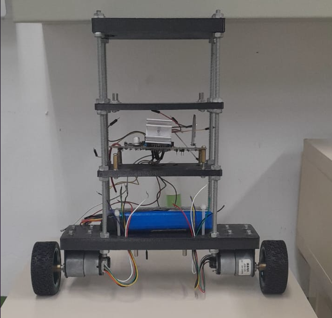

   Figura 1 – Pêndulo invertido utilizado.   
  
   Fonte: Dos autores (2026).

Desenvolvimento
***************

A Etapa 1 do projeto foi dedicada à análise do sistema existente e ao levantamento das informações necessárias para o desenvolvimento do controle do pêndulo invertido. Inicialmente, realizou-se a identificação dos principais componentes do sistema,  com o objetivo de compreender o funcionamento do sistema já implementado. Isso permite a implementação adequada da estratégia de controle, considerando as características individuais de cada componente.

Para isso, foram analisados os motores utilizados, sendo estes do tipo JGB-520, com velocidade nominal de 333 RPM e alimentação de 12 V, cujas características podem ser vistas abaixo.

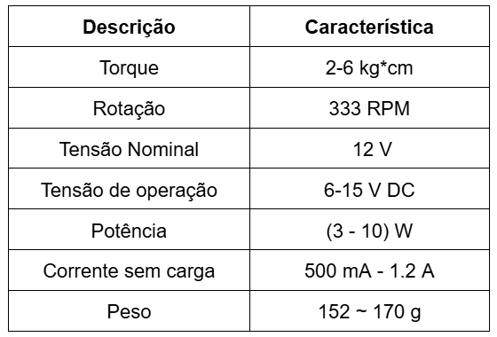

   Figura 2 – Características do motor.   
  
   Fonte: Adaptado de Mikroelectron (2026).

Além disso, foi identificada a utilização de uma ponte H do tipo L298, responsável pelo acionamento dos motores de corrente contínua. A ponte H é um circuito de potência que permite o controle da velocidade e do sentido de rotação dos motores por meio de sinais PWM gerados pelo microcontrolador, fornecendo a corrente necessária para seu funcionamento. As informações podem ser observadas abaixo.

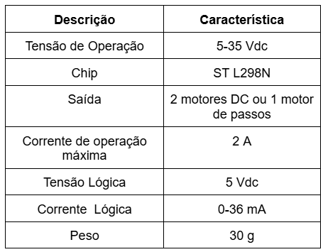
   
   Figura 3: Características da Ponte H.
  
   Fonte: Adaptado de STMicroelectronics (2000 apud PEDROSO; MODESTO, 2017).

O sistema também conta com um sensor do tipo MPU6050, que integra acelerômetro e giroscópio, sendo utilizado para a medição do ângulo de inclinação do pêndulo.

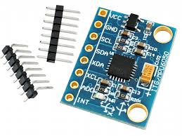
   
   Figura 4: Acelerômetro e Giroscópio 3 Eixos.
   
   Fonte: Eletrônica Cuiabá (2026).

Ademais, foi identificada a fonte de alimentação do sistema, composta por uma bateria LiPo (polímero de lítio). Esse tipo de bateria apresenta alta densidade de energia, e requer cuidados do manuseio e operação, pois podem pegar fogo. Dessa forma,elas não podem ser perfuradas, amassadas e serem  sobrecarregadas. 
As características  da bateria utilizada podem ser observadas a seguir.

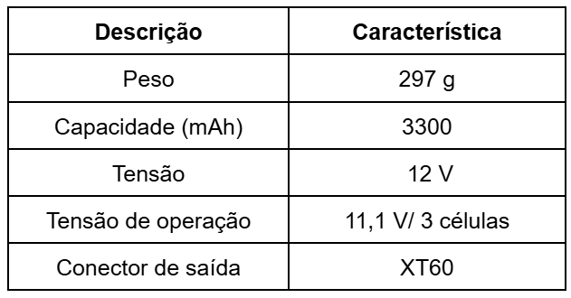
  
   Figura 5: Característica da bateria  LiPo.
   
   Fonte: VISTRONICA(2026)

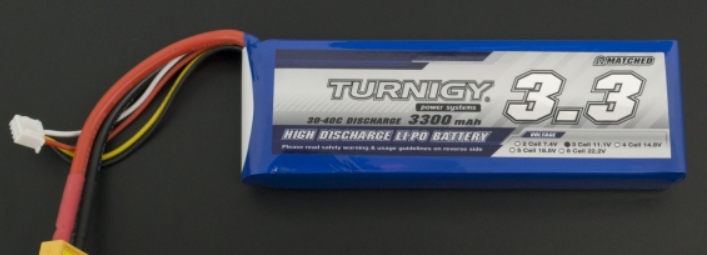
  
   Figura 6: Bateria LiPo.
   
   Fonte: VISTRONICA(2026)

Além disso, foi identificado o circuito de medição e condicionamento de sinais, baseado no amplificador operacional LM324,
responsável pela leitura analógica de grandezas como a carga dos motores e o nível da bateria. 
Também foi identificado um módulo Bluetooth, que permite a comunicação e o controle remoto do sistema. 
Por fim, um regulador externo do tipo buck, 
responsável por estabilizar a tensão da bateria e fornecer uma saída de +5 V.

Dentre as técnicas estudadas, destaca-se o controlador PID (Proporcional, Integral e Derivativo), que é muito utilizado em sistemas de controle devido à sua estrutura que é relativamente simples e possui maior facilidade de implementação. Ele atua com base no erro entre o valor desejado (referência) e o valor medido da variável de interesse, sendo composto por três ações distintas:

* A ação proporcional, que reage  ao erro.
* A ação integral, que acumula o erro ao longo do tempo e elimina erros em regime permanente.
* A ação derivativa, que antecipa o comportamento do sistema ao considerar a taxa de variação do erro.

Apesar disso, o PID é um controlador monovariável, o que significa que ele atua diretamente sobre apenas uma variável de saída por vez. Em sistemas mais complexos, como o pêndulo invertido, que apresenta múltiplas variáveis de estado e forte acoplamento entre elas, a aplicação de um único controlador PID pode não ser suficiente para garantir um desempenho adequado do sistema como um todo. Isso ocorre porque o acoplamento entre essas variáveis é forte, de modo que a ação de controle sobre uma delas pode influenciar diretamente as demais.

Além disso, o pêndulo invertido é um sistema não linear e instável, enquanto o PID é um controlador linear, o que pode limitar seu desempenho em diferentes condições de operação. Outro ponto importante é que o PID pode apresentar sensibilidade a perturbações externas e a incertezas no modelo, e a sintonia de seus parâmetros (Kp, Ki e Kd) pode ser desafiadora, o que pode impactar no desempenho do sistema

Outra técnica analisada foi o controle LQR (Linear Quadratic Regulator), que se baseia na representação em espaço de estados. Diferentemente do PID, o LQR é naturalmente um controlador multivariável, sendo capaz de atuar simultaneamente em  diversas variáveis do sistema. Ele funciona a partir da definição de um modelo.Esse método utiliza um modelo matemático do sistema baseado em variáveis de estado e define um critério de desempenho que busca minimizar os erros do sistema e o esforço de controle aplicado. A partir disso, o método calcula automaticamente uma matriz de ganhos, resultando em um controle eficiente e balanceado entre desempenho e consumo de energia.

No contexto do pêndulo invertido, o LQR apresenta uma vantagem significativa, pois consegue estabilizar o sistema considerando simultaneamente variáveis como o ângulo, a velocidade, a posição e sua velocidade linear. Isso permite uma  resposta melhor, rápida e coordenada em comparação com o PID. Entretanto,a maior dificuldade do LQR está na necessidade de um modelo matemático preciso do sistema. A obtenção deste modelo envolve  modelagem física, linearização e identificação de parâmetros, o que é bem mais trabalhoso. Caso o modelo não represente adequadamente o sistema real, o desempenho do  controlador é comprometido. 

Dessa forma, observa-se que enquanto o PID se destaca pela simplicidade e facilidade de implementação, o LQR oferece um desempenho superior em sistemas multivariáveis, desde que tenha uma modelagem bem feita. A definição da técnica a ser utilizada neste projeto será realizada na próxima etapa, após a análise do comportamento do sistema em malha aberta e a identificação de seus parâmetros.

Além da análise dos controladores, foram realizados testes no sistema já implementado para verificar o funcionamento dos componentes, bem como o desenvolvimento da modelagem inicial do sistema.

Testes
======
Os testes iniciais do sistema já existente foram realizados com o objetivo de verificar o funcionamento dos componentes. Para isso, avaliou-se o desempenho dos motores utilizando uma alimentação entre 6 V e 11 V, 
o que permitiu observar seu funcionamento, o qual ocorreu conforme o esperado. 

Em seguida, foi realizado teste de funcionamento na placa. Para isso, ela foi alimentada com 10 V, e utilizaria-se um código de teste obtido na internet, em conjunto com um Arduino, com o objetivo de avaliar o funcionamento do giroscópio e do acelerômetro.

Entretanto, os resultados obtidos não foram satisfatórios. Durante o teste, observou-se um aumento da corrente até aproximadamente 700 mA por um curto intervalo de tempo, enquanto a tensão permanecia próxima de 3 V. Isso indica a possível existência de uma falha elétrica na placa, que não foi possível localizar onde estaria.

Diante disso, embora a causa  da falha não tenha sido encontrada e considerando também o estado físico já degradado da placa, uma vez que foi confeccionada há alguns anos, optou-se pela elaboração de uma nova placa com os mesmos componentes.

Modelagem do Sistema
======

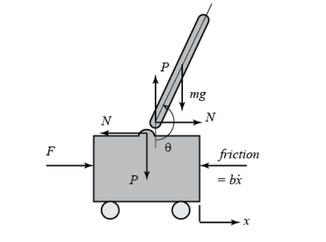
  
   Figura 7: Modelo do sistema pêndulo invertido.
  
   Fonte: UNIVERSITY OF MICHIGAN (2026).

O sistema clássico de pêndulo invertido, normalmente é composto por um carrinho com movimento horizontal e uma haste rígida articulada em um único ponto, é naturalmente instável, pois a haste tende a cair sob o efeito da gravidade; no entanto, ele pode ser estabilizado aplicando-se uma força horizontal adequada ao carrinho para manter a haste na posição vertical.

A estrutura real é um corpo rígido de quatro andares de plástico, sendo a base a maior e contendo a bateria, motores e uma roda de cada lado, com quatro hastes (provavelmente de alumínio) garantindo rigidez e a placa de controle no segundo andar; no entanto, como inicialmente precisamos testar a modelagem e apenas simularemos o sistema com valores próximos dos reais, será usado o sistema clássico do conjunto carro (com quatro rodas) e haste em vez do real, e mais à frente no projeto essa modelagem será refeita para a estrutura real.

Parâmetros Físicos do Sistema

Os parâmetros que influenciam diretamente a dinâmica são:

M - Massa do carro

m - Massa do pêndulo

b - Coeficiente de atrito do carro

l - Distância do eixo ao centro de massa

I - Inércia do pêndulo

F - Força aplicada no carro

x - Coordenada de posição do carro

θ - Ângulo do pêndulo com a vertical

φ - Ângulo do pêndulo com a horizontal (θ+90°)

Foram encontradas na literatura duas modelagens para o sistema clássico, comparadas pela monografia [1]: a primeira do livro Engenharia de Controle Moderno, de Ogata, e a segunda do Matlab. Ambas foram estudadas para, no futuro, modelar o "robô pêndulo invertido" real, mas a conclusão da monografia [1] mostra a importância da etapa de modelagem e que a ação do controlador é fortemente limitada por limitações na própria modelagem. Dessa forma, apenas a modelagem do Matlab, por possuir um desenvolvimento mais criterioso, será registrada aqui.

Modelagem Matlab
======
Forças no carro na direção horizontal 

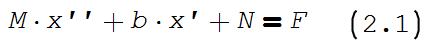
  
Não há informações úteis sobre as forças na direção vertical do carrinho no modelo clássico, pois ele se desloca apenas no eixo x e a haste gira em torno da articulação. No entanto, isso pode não ser válido para o modelo real, no qual o próprio carrinho será apenas uma grande haste.

Forças no pêndulo na horizontal

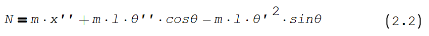

A combinação das equações 1 e 2 resulta na primeira equação que rege o comportamento do sistema.

Forças no pêndulo na vertical

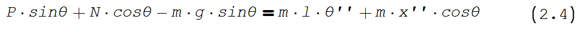

Momentos em torno do centro de massa

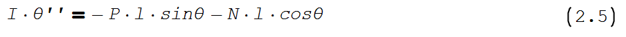

A combinação das equações 4 e 5, resulta na segunda equação que regje o sistema

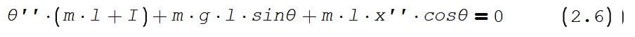

As análises de controle usuais aplicam-se apenas a sistemas lineares, tornando necessária a linearização por aproximação para pequenos ângulos (válida desde que o sistema não varie mais que 20°, conforme o Matlab). Futuramente, poderão ser feitas análises sobre possíveis problemas decorrentes dessas aproximações no controle, mas como em todas as análises o modelo foi considerado apenas para pequenos ângulos e sem mudanças bruscas no ângulo (θ''), as aproximações provavelmente não trarão problemas, porém, caso seja necessário um objetivo além de tornar o pêndulo estável na vertical, como andar em uma velocidade específica, que ficaria num anglo menor que 90°, os efeitos dessas aproximações terão que ser revistos.
Este modelo considera φ o ângulo a partir da superfície: 0° seria o pêndulo na superfície e 90° na vertical. Dessa forma, θ = π + φ. Considera-se senθ ≈ –φ, cosθ ≈ –1, e desprezam-se termos de segunda ordem (θ'').

Trabalhando algebricamente com as equações e resolvendo a equações diferencial por Laplace e relacionando a entrada (força F) com a saída Θ (posição angular da haste), tem-se
Com a linearização e a mudança da referencia do ângulo o as equações que modelam o sistema se tornam:

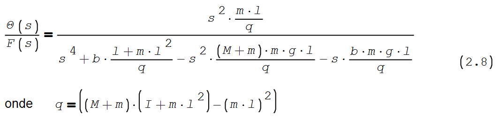

Que no espaço de estados é representado por:

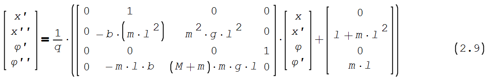

Referências (links/datasheets/livros)
*************************************

ABDUSAMADOV, Akbarkhon. Design and Implementation of an Inverted Pendulum Control System using FPGA and Reinforcement Learning. 2023. Dissertação (Mestrado em Engenharia Mecatrônica) – Politecnico di Torino, 2023.

CZECH, Arthur Schmietke. Estudo do sistema pêndulo invertido e implementação de um controlador PID para um robô de duas rodas. 2024. Trabalho de Conclusão de Curso (Engenharia Mecatrônica) – Universidade Federal de Santa Catarina, Centro Tecnológico de Joinville, Joinville, 2024.

ELETRÔNICA CUIABÁ. Acelerômetro e giroscópio 3 eixos MPU6050. Disponível em: <https://www.eletronicacuiaba.com/acelerometro-e-giroscopio-3-eixos-mpu-6050>. Acesso em: 25 mar. 2026.

MIKROELETRON. ME-13526. Disponível em: <https://mikroelectron.com/product/me-13526>. Acesso em: 25 mar. 2026.

PEDROSO, Caio Cesar de Souza; MODESTO, Eduardo La Pastina. Sistema de controle de pêndulo invertido. 2017. Trabalho de Conclusão de Curso – Universidade Tecnológica Federal do Paraná, Curitiba, 2017.

STMicroelectronics. L298 – Dual Full-Bridge Motor Driver. Disponível em: <https://cdn.sparkfun.com/assets/7/1/d/6/c/Full-Bridge_Motor_Driver_Dual_-_L298N.pdf>. Acesso em: 25 mar. 2026.

UNIVERSIDADE FEDERAL DE OURO PRETO. Controle de pêndulo invertido. Disponível em: <https://www.monografias.ufop.br/bitstream/35400000/1651/1/MONOGRAFIA_ControlePênduloInvertido.pdf>.Acesso em: 25 mar. 2026.

UNIVERSITY OF MICHIGAN. Inverted Pendulum: System Modeling. Control Tutorials for MATLAB and Simulink (CTMS). Disponível em: <https://ctms.engin.umich.edu/CTMS/index.php?example=InvertedPendulum&section=SystemModeling>
. Acesso em: 27 mar. 2026.

VISTRONICA. Bateria LiPo Turnigy 3300mAh 11.1V 30C. Disponível em: Acessar produto
. Acesso em: 27 mar. 2026.

