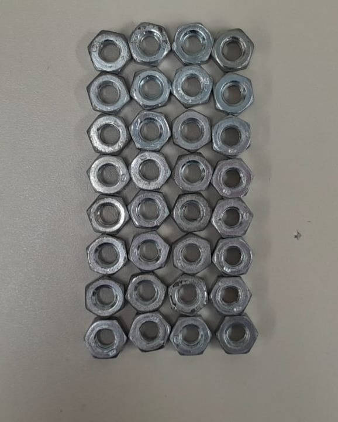
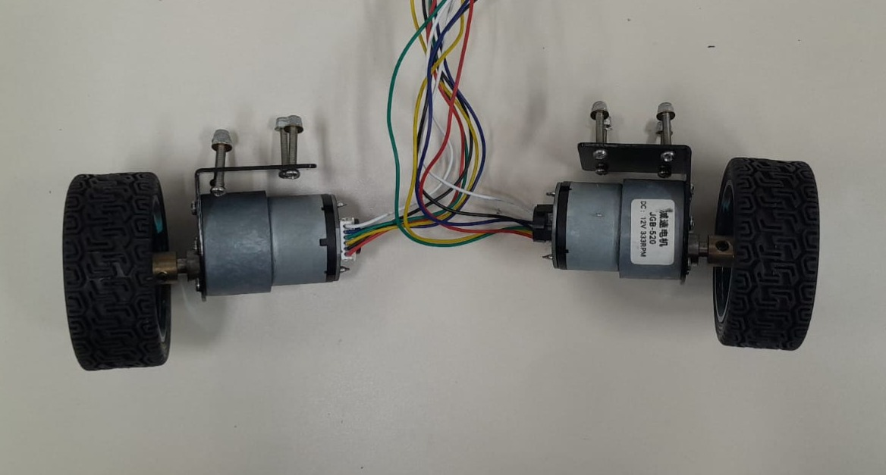
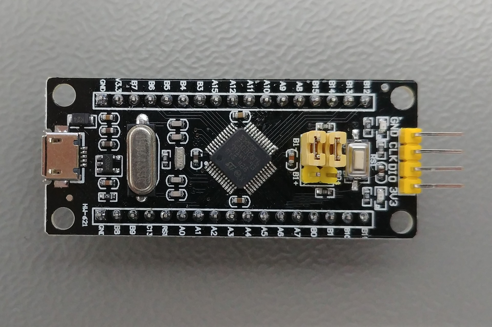
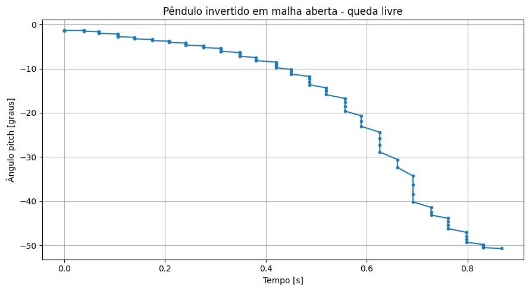

Etapa 2
#######

.. contents::
   :local:
   :depth: 2

Visão gerala
***********

A Etapa 2 consite na estruturação prática do sistema de controle, envolvendo a
análise e seleção de técnicas de controle  ao problema, bem como o desenvolvimento de uma interface para testes. Além disso, são realizados ensaios do sistema de acionamento  em malha aberta, permitindo a observação do seu comportamento. Nessa etapa também foi definido o microcontrolador a ser utilizado 
e realizado  a identificação de parâmetros fundamentais.

Desenvolvimento
***************

A primeira etapa desenvolvida consistiu na definição do método de controle a ser empregado no sistema.
Optou-se pela utilização do controle do tipo Linear Quadratic Regulator (LQR).

Embora o LQR exija a modelagem do sistema e maior esforço computacional quando comparado ao controle PID, 
ele se mostrou mais adequado para a aplicação proposta.
Isso se deve ao fato de o pêndulo invertido ser um sistema naturalmente instável, multivariável 
e altamente sensível a perturbações, características que dificultam a obtenção de desempenho satisfatório
por métodos empíricos.

O LQR permite a obtenção de uma lei de controle baseada em modelo, capaz de minimizar uma função de custo que pondera 
simultaneamente o erro de estado e o esforço de controle. Dessa forma, é possível garantir 
maior estabilidade, resposta dinâmica mais previsível.

Em seguida, realizou-se a caracterização do sistema com o objetivo de obter parâmetros físicos  para as etapas subsequentes de modelagem e projeto de controle. Para isso, o robô pêndulo invertido foi desmontado,
para  a medição individual de massa e dimensões de cada componente estrutural. 
Isso possibilitou a estimativa da distribuição de massa, dimensões características e,
posteriormente, a obtenção de parâmetros relevantes como centro de massa e momentos de inércia aproximados.

Inicialmente, foi medido o peso total do sistema completo, resultando em 1372 g.
Em seguida, as plataformas  foram removidas e analisadas individualmente, conforme apresentado na Tabela abaixo.

+---------------+----------+--------------+------------------+-------------+
| Componente    | Peso (g) | Largura (cm) | Comprimento (cm) | Altura (mm) |
+---------------+----------+--------------+------------------+-------------+
| Plataforma 1  | 371      | 7,50         | 24,1             | 15,0        |
+---------------+----------+--------------+------------------+-------------+
| Plataforma 2  | 58       | 7,50         | 15,0             | 7,3         |
+---------------+----------+--------------+------------------+-------------+
| Plataforma 3  | 50       | 7,50         | 15,0             | 7,4         |
+---------------+----------+--------------+------------------+-------------+
| Plataforma 4  | 57       | 7,50         | 15,0             | 15,3        |
+---------------+----------+--------------+------------------+-------------+

Sendo esses dados necessarios para a definição do controlador considerando o peso ja das  duas placas

+---------------+-------------------------------------------+-------------------+
| Símbolo       |             Parâmetro                     |       Valor       | 
+---------------+-------------------------------------------+-------------------+
|        M      |          Massa do Carro                   |    0,892 Kg       | 
+---------------+-------------------------------------------+-------------------+
|        m      |          Massa do Pêndulo                 |    0,510 Kg       |      
+---------------+-------------------------------------------+-------------------+
|        L      |  Distância ao centro de massa do pêndulo  |       0,227 m     | 
+---------------+-------------------------------------------+-------------------+
|        J      |   Momento de inércia do pêndulo           | 9,72*10^-3 kg m²  | 
+---------------+-------------------------------------------+-------------------+
|        g      |       Aceleração da Gravidade             |    9,81 m/s²      | 
+---------------+-------------------------------------------+-------------------+

 .. figure:: img/plataformas.jpg
   :width: 30%
   :align: center

   Figura 2 – Plataformas do robô.   
  
   Fonte: Dos autores (2026).

A Plataforma 1, que suporta a bateria, apresenta altura total de 48,6 mm quando montada.

As quatro hastes de sustentação possuem massa total de 41 g, diâmetro aproximado de 6,4 mm e comprimento de 28,7 cm, 
sendo responsáveis pela  estruturação e espaçamento entre os níveis do sistema.

 .. figure:: img/hastes.jpg
   :width: 30%
   :align: center

   Figura 2 – Haste presente no robô.   
  
   Fonte: Dos autores (2026).

Adicionalmente, o conjunto de porcas apresenta massa total de 104 g, 
que contribui significativamente para a massa no seu total, embora suas dimensões não sejam relevantes para a modelagem dinâmica.

   Figura 3 – Porcas.   
  
   Fonte: Dos autores (2026).

O conjunto motor-roda possui massa de 241 g, com diâmetro de roda de 65,4 mm, sendo este parâmetro essencial para
a relação entre deslocamento linear e rotação do motor.

   Figura 4 – Motores com as rodas.   
  
   Fonte: Dos autores (2026).

A partir desses dados, torna-se possível construir um modelo  aproximado do sistema.

Além disso, foi realizado o levantamento dos componentes necessários para o desenvolvimento do sistema
de controle do pêndulo invertido. Entretanto, como o robô já possui todos os elementos mecânicos e 
de atuação, não houve necessidade de aquisição ou substituição desses componentes.

Dessa forma, a única decisão de hardware relevante nesta etapa foi a escolha do microcontrolador responsável pela 
implementação do controle. Optou-se pela utilização da placa Blackpill (STM32F4), devido à sua capacidade de processamento, 
maior frequência de operação, presença de periféricos como temporizadores de alta resolução, comunicação serial e 
interfaces de entrada/saída, 
além de oferecer melhor desempenho em aplicações de controle em tempo real quando comparada a alternativas mais simples.

   Figura 5 – Microcontrolador Black Pill.   
  
   Fonte: Dos autores (2026).

Testes
======
Para a realização dos testes, foi desenvolvida uma interface dedicada à aquisição de dados do giroscópio e do acelerômetro do sensor MPU6050. Inicialmente, essa interface foi projetada para operação no microcontrolador STM32F4. No entanto, após diversas tentativas de implementação, identificou-se um problema na comunicação via protocolo I²C, o qual não pôde ser solucionado dentro do prazo disponível.

Dessa forma, optou-se pela utilização de uma plataforma Arduino para a aquisição dos dados, garantindo a continuidade dos experimentos e a confiabilidade das medições.

A seguir, é apresentado uma tabela  correspondentes aos dados obtidos do giroscópio durante o processo de calibração. 

+---------------+-------------------------------------------+---------------------------+
|Eixo Vertical  |    Inclinação para frente e para trás     |   Inclinação para lateral | 
+---------------+-------------------------------------------+---------------------------+
|     -0,02     |                   0,00                    |           -0,03           | 
+---------------+-------------------------------------------+---------------------------+
|     -0,02     |                   0,01                    |           -0,03           |      
+---------------+-------------------------------------------+---------------------------+
|     -0,03     |                   0,01                    |           -0,04           | 
+---------------+-------------------------------------------+---------------------------+
|     -0,03     |                   0,01                    |           -0,05           | 
+---------------+-------------------------------------------+---------------------------+
Após a realização da calibração, foram conduzidos testes com o objetivo de verificar o correto funcionamento do sistema. 
Um recorte representativo dos resultados obtidos é apresentado a seguir.

+---------------+-------------------------------------------+---------------------------+
|Eixo Vertical  |    Inclinação para frente e para trás     |   Inclinação para lateral | 
+---------------+-------------------------------------------+---------------------------+
|     1,05      |                  -19,09                   |           -0,38           | 
+---------------+-------------------------------------------+---------------------------+
|     1,04      |                  -19,10                   |           -0,38           |      
+---------------+-------------------------------------------+---------------------------+
|     1,04      |                  -19,21                   |           -0,37           | 
+---------------+-------------------------------------------+---------------------------+
|     1,04      |                  -20,02                   |           -0,40           | 
+---------------+-------------------------------------------+---------------------------+
Após a etapa de calibração, foi realizado um ensaio em malha aberta, no qual foram obtidos os seguintes recortes de dados experimentais. O teste não foi conduzido até a queda completa do pêndulo, uma vez que o microcontrolador não estava fixado à estrutura. 
Nessas condições, a queda total poderia comprometer as conexões elétricas ou até ocasionar a ruptura de fios.

Dessa forma, o pêndulo foi inicialmente posicionado na vertical e liberado, sendo permitido seu movimento até aproximadamente 45°,
para  garantir a integridade do sistema durante a aquisição dos dados

+---------------+-------------------------------------------+---------------------------+
|Eixo Vertical  |    Inclinação para frente e para trás     |   Inclinação para lateral | 
+---------------+-------------------------------------------+---------------------------+
|    -0,14      |                  -1,42                    |           -0,09           | 
+---------------+-------------------------------------------+---------------------------+
|     -0,17     |                  -3,12                    |           -0,12           |      
+---------------+-------------------------------------------+---------------------------+
|    -0,22      |                  --6,11                   |           -0,15           | 
+---------------+-------------------------------------------+---------------------------+
|    -0,26      |                  -10,23                   |           -0,18           | 
+---------------+-------------------------------------------+---------------------------+
|    -0,32      |                  -13,65                   |           -0,22           | 
+---------------+-------------------------------------------+---------------------------+
|    -0,58      |                  -24,38                   |           -0,31           | 
+---------------+-------------------------------------------+---------------------------+
|    -0,89      |                  -40,13                   |           -0,39           | 
+---------------+-------------------------------------------+---------------------------+
|    -1,12      |                  -50,22                   |           -0,34           | 
+---------------+-------------------------------------------+---------------------------+
Assim, foi possível construir um gráfico representativo da evolução angular do pêndulo ao longo do tempo, 
permitindo a análise de sua queda em malha aberta.

   Figura 6 – Gráfico da inclinação frente/atrás.   
  
   Fonte: Dos autores (2026).

   .. figure:: img/YPR.png
   :width: 30%
   :align: center

   Figura 7 – Graficos Com todos os valores.   
  
   Fonte: Dos autores (2026).

