Etapa 3
#######

.. contents::
   :local:
   :depth: 2

Visão geral
***********

A Etapa 3 consiste no desenvolvimento e consolidação do sistema de 
controle em malha fechada, incluindo a definição dos componentes do 
hardware de controle e o desenvolvimento do esquemático da placa controladora. 
Além disso, é realizado o projeto do controlador, juntamente com a melhoria 
do modelo matemático. Por fim, são conduzidos testes em malha fechada, 
para a validação do desempenho do controlador 
e a análise do comportamento dinâmico do sistema sob realimentação.

Desenvolvimento
***************
Definição dos componentes do hardware de controle.
==================================================
A definição dos componentes utilizados no hardware de controle já havia sido prevista na Etapa 2, 
na qual foi considerado apenas o uso do microcontrolador STM32 (BlackPill). 
Durante a Etapa 3, dedicada à implementação do controlador,
constatou-se que a única necessidade da equipe para o hardware de controle era, de fato, 
a utilização do STM32, sendo este suficiente para atender aos requisitos de processamento e execução do sistema de controle proposto.

Controlador
===========
Nessa etapa foi realizado o desenvolvimento do controlador, após a obtenção dos 
parâmetros necessários para a modelagem do sistema. 
Inicialmente, foi desenvolvido o modelo matemático teórico do pêndulo invertido, 
utilizado como base para o projeto do controlador. 
Como a estratégia de controle adotada foi o controlador
LQR (Linear Quadratic Regulator), 
foram obtidas as equações de espaço de estados do sistema, 
bem como a substituição dos parâmetros físicos previamente identificados. 
As equações desenvolvidas e os respectivos valores utilizados podem ser observados a seguir.

   Figura 1 – Matriz P.
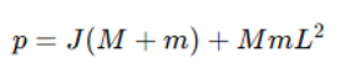
  
   Figura 2 – Matriz A.
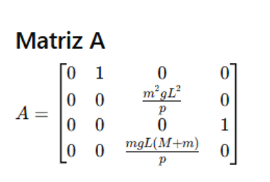

   Figura 3 – Matriz B.
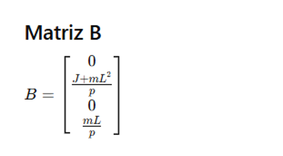

   Figura 4 – Vetor de Estados.
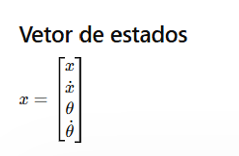

   Figura 5 – Equações de Estados.
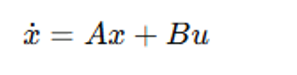

   Figura 6 – Matriz Q.
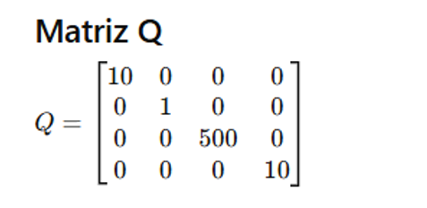

   Figura 7 – Matriz R.
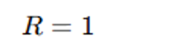

   Figura 8 – Função Custo do LQR.
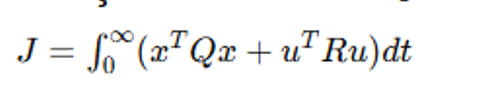

   Figura 9 – Função Algébrica de Riccati.
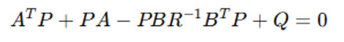

   Figura 10 – Ganho LQR.
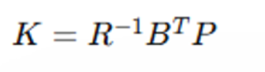

   Figura 11 – Lei de controle.
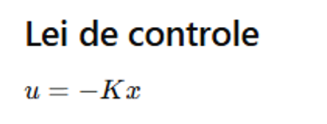

   Figura 12 – Lei de controle Expandida.
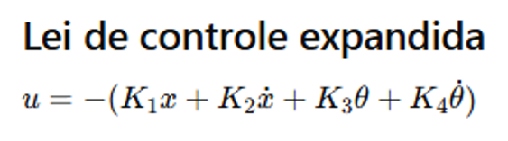

   Figura 13 – Sistema em Malha Fechada.
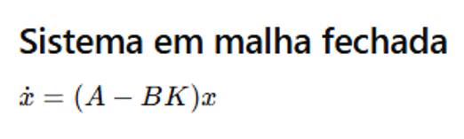

    Figura 14 – Autovalores do Sistema.
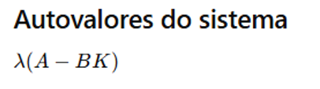

   Figura 15 – Discretização.
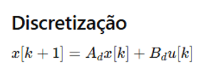

   Figura 16 – Matriz Discretizada Ad.
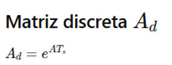

Durante o desenvolvimento do controlador, 
conversar com o  professor da matéria de controle, 
optou-se inicialmente por desconsiderar os coeficientes práticos de amortecimento translacional e rotacional do sistema, 
assumindo-os como nulos. Isso foi adotado considerando o pior cenário e simplificando a etapa inicial de modelagem e validação do controlador.

Após a obtenção completa do modelo matemático, foi utilizado o software MATLAB para a realização das simulações e validação do controlador projetado.
Por meio das simulações, foi possível ajustar os parâmetros da matriz de ponderação do controlador LQR, analisar a resposta dinâmica 
do sistema e verificar a estabilidade do pêndulo.

A partir dos resultados obtidos nas simulações, foi possível observar
o comportamento temporal das variáveis de estado do sistema, como posição do carro, velocidade, ângulo do pêndulo e velocidade angular,
senod possivel avaliar o desempenho do controlador em relação ao tempo de acomodação, estabilidade e capacidade de rejeição das perturbações.
Os gráficos gerados e os respectivos resultados podem ser observados a seguir.

+---------------+---------+-----------+-----------+----------+
|    Ganhos K   | -3.1623 |  -4.9994  |  50.9704  |  8.0437  | 
+---------------+---------+-----------+-----------+----------+

+---------------+--------------------------------+
|      Autovalores em malha fechada:             |        
+---------------+--------------------------------+
|              -11.5614 + 0.0000i                |
+---------------+--------------------------------+
|              -7.1087 + 0.0000i                 |
+------------------------------------------------+
|              -0.7979 + 0.7363i                 |
+------------------------------------------------+
|              -0.7979 - 0.7363i                 |      
+------------------------------------------------+

.. figure:: img/velocidade.png
   :width: 40%
   :align: center

   Figura 17 – Velocidade.

   Fonte: Dos autores (2026).

.. figure:: img/angulo.png
   :width: 40%
   :align: center

   Figura 18 – Ângulo.

   Fonte: Dos autores (2026).

.. figure:: img/posição.png
   :width: 40%
   :align: center

   Figura 19 – Posição.

   Fonte: Dos autores (2026).

.. figure:: img/velocidadeAng.png
   :width: 40%
   :align: center

   Figura 20 – Velocidade Angular.

   Fonte: Dos autores (2026).

.. figure:: img/sinalControle.png
   :width: 40%
   :align: center

   Figura 21 – Sinal de Controle.

   Fonte: Dos autores (2026).
   
Além disso, foi realizada a simulação do pêndulo invertido utilizando o ambiente Simulink, 
integrado ao software MATLAB. Inicialmente, foi desenvolvido o modelo em espaço de estados do sistema por meio de blocos,
permitindo representar matematicamente a dinâmica do pêndulo invertido dentro do ambiente de simulação.

Essa etapa teve como principal objetivo verificar o funcionamento do controlador
projetado antes da implementação prática no sistema físico. A partir da modelagem realizada,
foi possível analisar a resposta dinâmica do sistema em malha fechada, observando o comportamento das variáveis de estado 
e a capacidade do controlador em estabilizar o pêndulo na posição de equilíbrio.
Os blocos utilizados na modelagem do sistema, bem como os resultados obtidos durante a simulação do pêndulo invertido, podem ser visualizados a seguir.
  
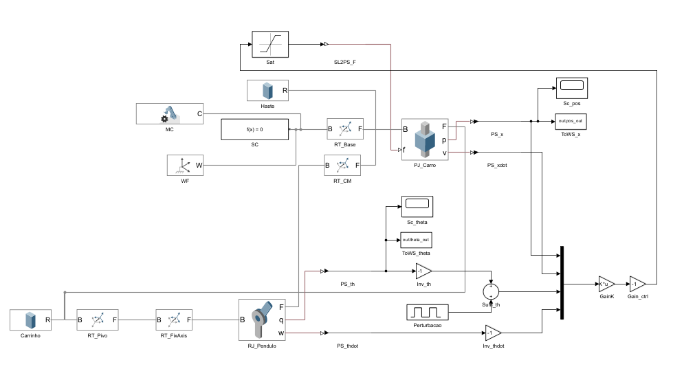

   Figura 22 – Diagrama de Blocos.

   Fonte: Dos autores (2026).

.. figure:: img/gif.gif
   :width: 70%
   :align: center

   Figura 23 – Gif do pêndulo funcionando na simulação.

   Fonte: Dos autores (2026).

Testes em Malha Fechada
=======================
Após o desenvolvimento do sistema de controle, foram implementados os códigos dpara  à execução no microcontrolador,
utilizando as rotinas e estruturas previamente definidas para aquisição de dados, processamento dos estados do sistema e atuação dos motores. Em seguida, iniciaram-se os primeiros  testes  em malha aberta com o controlador.

Os resultados iniciais mostraram que o carrinho apresentava comportamento de  tentativa de estabilização do pêndulo. 
Entretanto, o sinal de controle aplicado aos motores possuía um valor de PWM muito alto, fazendo com que as rodas respondessem com velocidade muito alta. Como consequência, o sistema não conseguia manter o pêndulo estabilizado, devido à atuação  agressiva dos motores e à incapacidade de realizar correções suaves e controladas.

Dessa forma, ainda durante os testes iniciais, realizou-se a redução do valor máximo permitido para o PWM dos motores, com o objetivo de diminuir a velocidade de deslocamento do carrinho e tornar a resposta do sistema mais controlável.

Após isso, realizou-se os ajustes no controle....

Desenvolvimento do esquemático da placa controladora.
*****************************************************
O shield para a placa STM32 Black Pill foi desenvolvido com o objetivo de facilitar a integração do sistema de controle do pêndulo invertido. A proposta principal foi criar uma placa PCB dedicada que servisse como interface entre a Black Pill e os demais componentes eletrônicos do sistema, organizando as conexões.

Durante o desenvolvimento do shield, optou-se por disponibilizar todos os pinos do microcontrolador em conectores externos. Isso foi feito  para tornar a placa mais flexível,e tambémm para maior facilidade, uma vez que a placa ja existente no pêndulo utiliza conectores externos e não fixos na placa.

Como medida de proteção elétrica, foi adicionado um fusível na entrada de alimentação da placa, com a função de proteger tanto o shield quanto a placa principal contra possíveis curtos-circuitos ou sobrecorrentes durante os testes e operação do sistema. A utilização do fusível aumenta a segurança do projeto e reduz o risco de danos ao microcontrolador e aos demais componentes eletrônicos.

O projeto eletrônico e o layout da PCB foram desenvolvidos no software KiCad. Inicialmente foi elaborado o esquemático elétrico contendo a conexão da Black Pill com os conectores. Em seguida, foi realizado o roteamento das trilhas e posicionamento dos componentes visando que a placa ficasse compacta.
Para realizar a conexão da Black Pill ao shield, foi utilizado um conector do tipo Conn_02x20, representando os 40 pinos disponíveis da placa. Além disso, foram adicionados dois conectores Conn_01x20, responsáveis por disponibilizar externamente todos os GPIOs do microcontrolador para futuras implementações, podendo ser visualizados a seguir.

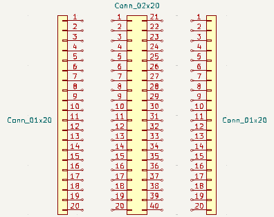

Os conectores utilizados seguem o padrão de pinos com passo de 2,54 mm, amplamente utilizado em placas de prototipagem e desenvolvimento eletrônico. A distância entre as duas fileiras de pinos da Black Pill também foi mantida conforme o padrão físico da placa de 15,24 mm,  sem necessidade de adaptações mecânicas, assim ficando como a imagem abaixo.

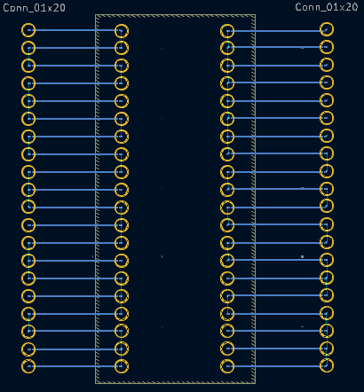

Testes
======

Descrição dos testes/validações realizadas.

(Outras subseções se necessário)
================================

Referências (links/datasheets/livros)
*************************************

MATHWORKS. Get Started with Simulink. Natick, 2026. Disponível em: MathWorks Simulink Getting Started. Acesso em:11 maio 2026.

MATHWORKS. lqr. Natick, 2026. Disponível em: MathWorks LQR Documentation. Acesso em: 8 maio 2026.

UNIVERSITY OF MICHIGAN. Control Tutorials for MATLAB and Simulink (CTMS): Simulink Basics. Ann Arbor, [s.d.]. Disponível em: CTMS Simulink Basics. Acesso em:11 maio 2026.

