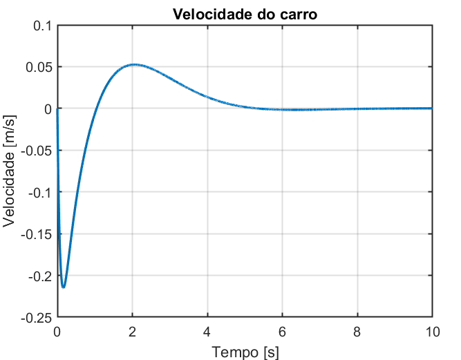
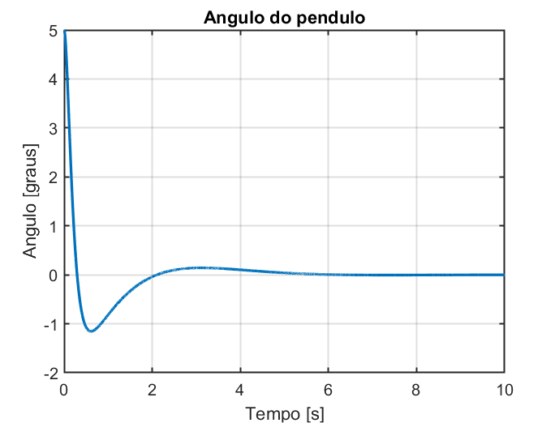
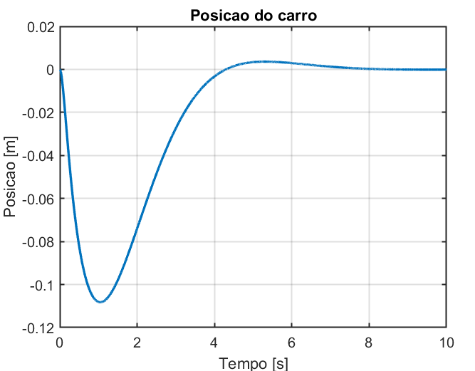
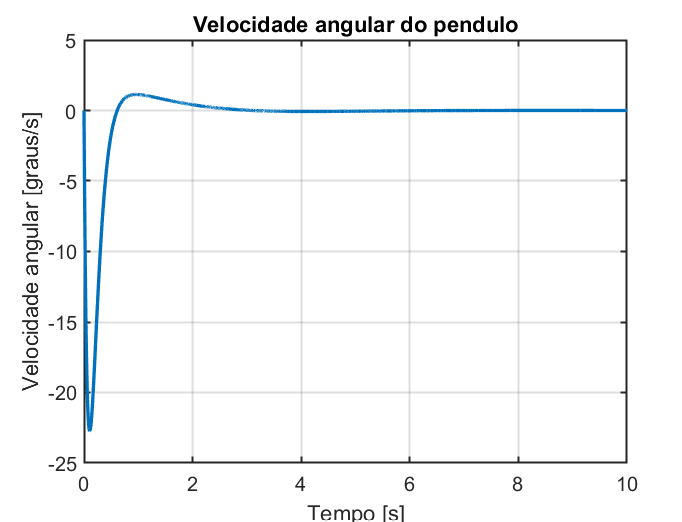
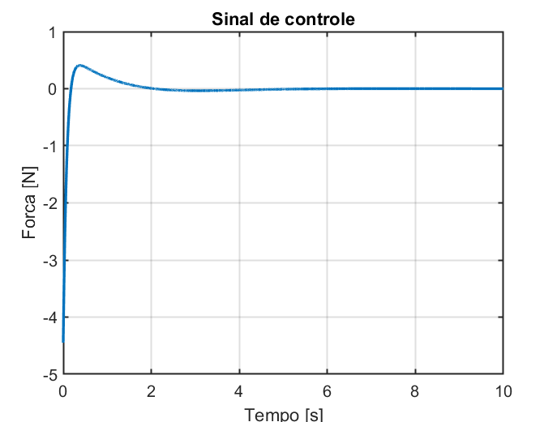
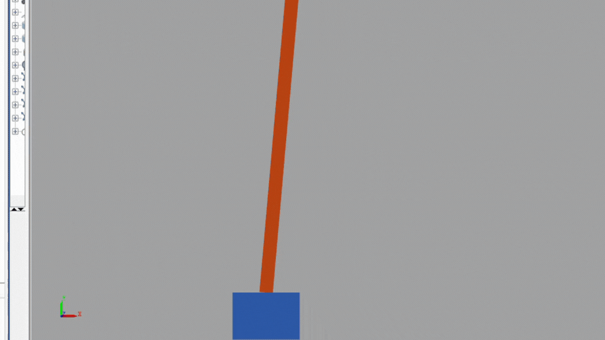

Etapa 3
#######

.. contents::
   :local:
   :depth: 2

Visão geral
***********

A Etapa 3 consiste no desenvolvimento e consolidação do sistema de 
controle em malha fechada, incluindo a definição dos componentes do 
hardware de controle e o desenvolvimento do esquemático da placa controladora. 
Além disso, é realizado o projeto do controlador, juntamente com a melhoria 
do modelo matemático. Por fim, são conduzidos testes em malha fechada, 
para a validação do desempenho do controlador 
e a análise do comportamento dinâmico do sistema sob realimentação.

Desenvolvimento
***************

Controlador
===========
 Nessa etapa foi realizado o desenvolvimento do controlador, após a obtenção dos 
 parâmetros necessários para a modelagem do sistema. 
 Inicialmente, foi desenvolvido o modelo matemático teórico do pêndulo invertido, 
 utilizado como base para o projeto do controlador. 
 Como a estratégia de controle adotada foi o controlador
 LQR (Linear Quadratic Regulator), 
 foram obtidas as equações de espaço de estados do sistema, 
 bem como a substituição dos parâmetros físicos previamente identificados. 
 As equações desenvolvidas e os respectivos valores utilizados podem ser observados a seguir.

   Figura 2 – Velocidade.   
  
   Fonte: Dos autores (2026).
   

   Figura 2 – Ângulo.   
  
   Fonte: Dos autores (2026).

   Figura 2 –Posição.   
  
   Fonte: Dos autores (2026).

   Figura 2 – Velocidade Angular.   
  
   Fonte: Dos autores (2026).

   Figura 2 – Sinal de Controle.   
  
   Fonte: Dos autores (2026).

Durante o desenvolvimento do controlador, 
conversar com o  professor da matéria de controle, 
optou-se inicialmente por desconsiderar os coeficientes práticos de amortecimento translacional e rotacional do sistema, 
assumindo-os como nulos. Isso foi adotado considerando o pior cenário e simplificando a etapa inicial de modelagem e validação do controlador.

Após a obtenção completa do modelo matemático, foi utilizado o software MATLAB para a realização das simulações e validação do controlador projetado.
Por meio das simulações, foi possível ajustar os parâmetros da matriz de ponderação do controlador LQR, analisar a resposta dinâmica 
do sistema e verificar a estabilidade do pêndulo.

A partir dos resultados obtidos nas simulações, foi possível observar
o comportamento temporal das variáveis de estado do sistema, como posição do carro, velocidade, ângulo do pêndulo e velocidade angular,
senod possivel avaliar o desempenho do controlador em relação ao tempo de acomodação, estabilidade e capacidade de rejeição das perturbações.
Os gráficos gerados e os respectivos resultados podem ser observados a seguir.

   Figura 2 – Plataformas do robô.   
  
   Fonte: Dos autores (2026).

Além disso, foi realizada a simulação do pêndulo invertido utilizando o ambiente Simulink, 
integrado ao software MATLAB. Inicialmente, foi desenvolvido o modelo em espaço de estados do sistema por meio de blocos,
permitindo representar matematicamente a dinâmica do pêndulo invertido dentro do ambiente de simulação.

Essa etapa teve como principal objetivo verificar o funcionamento do controlador
projetado antes da implementação prática no sistema físico. A partir da modelagem realizada,
foi possível analisar a resposta dinâmica do sistema em malha fechada, observando o comportamento das variáveis de estado 
e a capacidade do controlador em estabilizar o pêndulo na posição de equilíbrio.

Os blocos utilizados na modelagem do sistema, bem como os resultados obtidos durante a simulação do pêndulo invertido, podem ser visualizados a seguir.
  
   .. figure:: img/blocos.png
   :width: 70%
   :align: center

   Figura x – x   
  
   Fonte: Dos autores (2026).

 

   Figura x – x   
  
   Fonte: Dos autores (2026).

Testes
======

Descrição dos testes/validações realizadas.

(Outras subseções se necessário)
================================

Referências (links/datasheets/livros)
*************************************

- `nRF Connect SDK <https://developer.nordicsemi.com/nRF_Connect_SDK/doc/2.4.2/nrf/getting_started/modifying.html#configure-application>`_

