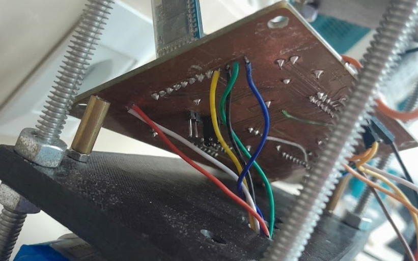
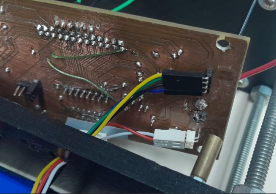
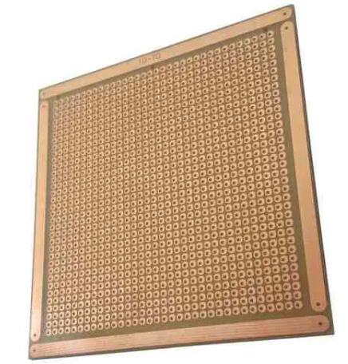
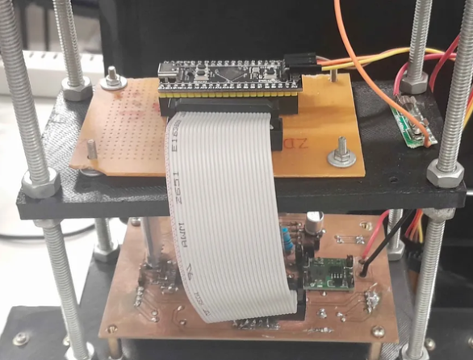
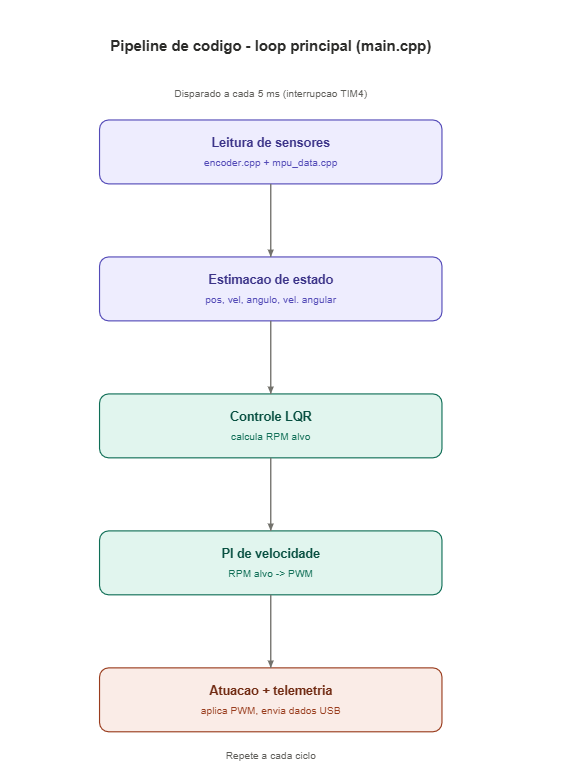
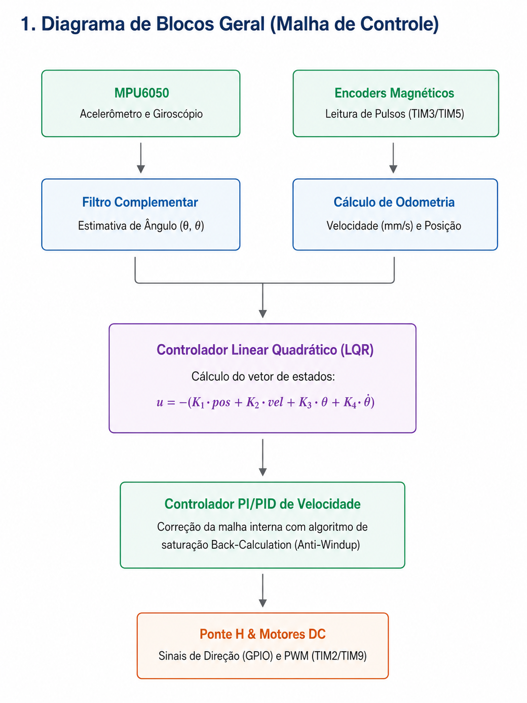

Etapa 4
#######

.. contents::
   :local:
   :depth: 2

Visão geral
***********

A etapa 4 consiste na fabricação da PCB e sua integração ao robô, junto com os ajustes e refinamentos necessários no software de controle desenvolvido na etapa anterior. Além disso,  é realizado os testes de estabilidade para avaliar o desempenho do sistema, identificar falhas de funcionamento e implementar as correções  para que o robô opere conforme o comportamento esperado ao final.
A etapa 4 é a etapa mais curta, uma vez que essa se  refere apenas aos ajustes de partes ja realizadas nas etapas anteriores 

Desenvolvimento
***************

A primeira parte do desenvolvimento da etapa 4 começou com  a melhoria da placa que já estava instalada no robô. Essa placa era antiga e, como foi necessário retirar e adicionar alguns cabos durante os testes, percebeu-se que as soldas dos cabos estavam bastante danificadas. Isso fazia com que os cabos se desconectassem com frequência e até identificar que o problema era esse, demorava bastante tempo.

Esse problema acontecia principalmente porque, durante os testes do sistema de controle, o robô precisava ser colocado em funcionamento várias vezes e  como estávamos testando acabava caindo durante os ensaios. Com o impacto das quedas e a movimentação dos cabos, as conexões acabavam se soltando, prejudicando os testes e dificultando a identificação correta dos problemas do sistema.

Para resolver isso, foram adicionados conectores na placa. Com essa alteração, as ligações ficaram mais organizadas, a montagem ficou mais limpa e a chance de desconexão diminuiu. Além disso, o uso de conectores facilita a manutenção, já que caso seja necessário retirar a placa do robô eles poder ser removidos e recolocados com mais segurança.

Durante essa etapa também foi identificado outro problema relacionado aos encoders dos motores, que não estavam funcionando. Inicialmente, acreditava-se que o erro poderia estar no código, pois na primeira vez que testamos eles estavam funcionando. Porém, ao analisar a placa e comparar as conexões com o datasheet do fabricante, verificou-se que a pinagem indicada não correspondia ao comportamento real observado.

Isso ficou mais claro ao testar outro motor, no qual foi possível observar o acionamento de uma luz indicativa que não acendia no motor instalado no robô. A partir disso, as conexões foram  alteradas. Após a correção da ligação dos pinos, os encoders passaram a funcionar, mostrando que o problema não estava no software, mas sim na conexão elétrica feita com base em uma pinagem incorreta.
  

   Figura 1 – Conexões antigas.

   Figura 2 – Conexões novas.

Após a melhoria da placa já existente no robô, iria ser iniciada a confecção da nova PCB, considerando as modificações realizadas no KiCad a partir das orientações dos professores. Isso porque, durante os testes, percebeu-se que a montagem em protoboard estava dificultando bastante a organização do sistema.

Como eram utilizados muitos cabos, as conexões  ficavam mais frágeis e confusas. Isso atrapalhava principalmente a etapa de testes, que é uma das partes mais importantes do desenvolvimento, pois é nela que se verificava se o robô esta respondendo corretamente se o sistema de controle esta funcionando como esperado.

Por esse motivo, foi sugerida a utilização de uma placa perfurada de fenolite, também conhecida como  placa padrão ilhada. Essa placa já possui furos para a fixação dos componentes e pode ser cortada e ajustada para caber melhor dentro do robô. Diferente de uma PCB típica, na placa ilhada as trilhas são feitas manualmente,  por meio de soldas e pequenos fios de ligação.

   Figura 3 – Placa padrão ilhada.
   

Como o esquemático da placa já havia sido desenvolvido no KiCad, a montagem nessa placa foi feita seguindo as conexões já definidas anteriormente. Dessa forma, foi necessário apenas analisar o esquemático e reproduzir manualmente as ligações entre os componentes.

Essa solução foi escolhida por ser mais simples e rápida, que era o que o grupo precisava. Como o objetivo principal naquele momento era validar o funcionamento do robô, principalmente a parte de controle, a fabricação de uma PCB definitiva poderia atrasar o desenvolvimento. A placa perfurada permitiu montar um circuito mais organizado do que a protoboard, mas sem exigir todo o processo de fabricação de uma placa final.

Além disso, foi adicionado um conector do tipo fita, com o objetivo de facilitar ainda mais as conexões  que vinham da placa já existente no robô. Com isso, a integração entre as placas ficou mais organizada e confiável, reduzindo a quantidade de fios soltos e facilitando, caso necessário, ajustes durante os testes.

Figura 4 – Placa com os componentes no robô.

Com relação ao código, foi incluído o encoder 2 no cálculo da velocidade do robô. Anteriormente, apenas o encoder 1 era efetivamente utilizado, enquanto o valor medido pelo segundo encoder era lido, mas não participava da estimativa final.  Isso limitava a representação do movimento real do carro, pois os dois motores não apresentam exatamente o mesmo comportamento, mesmo quando recebem o mesmo sinal de PWM.

Também foi feita uma reorganização na forma como as variáveis eram tratadas dentro do controle, centralizando  as contas principais em ponto fixo, utilizando valores normalizados, para reduzir o custo computacional e manter maior previsibilidade na execução do código. Nesse processo, foram revisadas as escalas usadas nas variáveis do controlador, incluindo os ajustes relacionados ao formato Q31, evitando que operações intermediárias causassem perda de precisão ou saturação indevida.

Outra parte importante foi a reestruturação da leitura dos encoders. Os pulsos passaram a ser utilizados para estimar a velocidade dos motores, convertendo a contagem em RPM e, posteriormente, em velocidade linear quando necessário. Essa conversão foi ajustada mais de uma vez, pois pequenos erros na escala ou no intervalo de tempo utilizado alteravam diretamente o valor entregue ao controle. Após as correções, a leitura passou a fornecer um valor mais coerente com o movimento real do robô.

Também foi feita a inicialização adequada do timestamp usado no cálculo das velocidades e no acompanhamento do tempo de execução do sistema. Para isso, passou-se a utilizar uma combinação entre o contador de loops e a função `HAL_GetTick`, permitindo controlar melhor os instantes de atualização das grandezas. Esse ajuste foi necessário porque o cálculo de velocidade depende diretamente do intervalo de tempo entre as leituras; se esse tempo não for inicializado ou atualizado corretamente, o valor calculado pode ficar incorreto mesmo com a contagem dos encoders funcionando.

Para reduzir oscilações nas leituras, foi implementado um buffer circular com 10 amostras para cada grandeza relevante. Esse buffer permitiu trabalhar com médias recentes, sem depender de uma atualização muito lenta, como ocorreria ao calcular o RPM apenas a cada 100 ms. Assim, foi possível suavizar o sinal de velocidade mantendo uma resposta mais rápida, o que é importante para um sistema de controle em tempo real.

Durante o desenvolvimento, também foi avaliada a possibilidade de relacionar a tensão aplicada aos motores com a velocidade obtida, com o objetivo de melhorar a modelagem do atuador. No entanto, acabou sendo descartada, pois houve conflito entre o uso do ADC e o segundo encoder. Além disso, para a estratégia de controle adotada, essa medição adicional não se mostrou indispensável, já que a realimentação pelos encoders fornecia uma estimativa mais direta da velocidade do robô.

Uma tentativa adicional foi utilizar apenas um timer para gerar os dois sinais de PWM dos motores. Essa solução seria interessante por simplificar a estrutura de temporização do código, mas não apresentou funcionamento adequado nas tentativas realizadas. Por esse motivo, a alteração não foi mantida, e a geração dos sinais de PWM continuou sendo tratada de forma separada para garantir maior estabilidade no acionamento dos motores.

Também foram feitos ajustes no sinal de PWM, pois em alguns testes o comportamento observado indicava que o comando aplicado aos motores não estava coerente com o esperado. Esse problema afetava principalmente a resposta do sistema quando o controle solicitava velocidades negativas. Inicialmente, o controle não funcionava corretamente nessa condição, o que impedia o robô de responder de forma adequada quando era necessário inverter o sentido de rotação dos motores. Após a correção, o bloco de controle do motor passou a aceitar setpoints positivos e negativos de RPM, convertendo o erro de velocidade no PWM necessário para aproximar a rotação medida da rotação desejada.

Foi criado, então, um bloco específico para o controle dos motores. Esse bloco recebe como entrada o setpoint de velocidade, em RPM, e compara esse valor com a velocidade estimada pelos encoders. A partir desse erro, calcula-se o PWM necessário para que o motor tente atingir a rotação desejada. Esse bloco foi testado separadamente antes de ser integrado ao controle principal, permitindo validar o funcionamento da malha de velocidade de forma isolada.

Apesar dessas melhorias, permaneceu uma limitação no cálculo do RPM. A estratégia adotada calcula a velocidade a partir da soma dos tempos entre pulsos do encoder. Isso melhora a resolução em baixas velocidades, mas não carrega diretamente a informação de sinal da rotação. Por isso, o sentido foi determinado posteriormente, verificando qual foi a direção predominante dos pulsos no intervalo analisado. Essa solução não é ideal para situações em que o motor inverte o sentido de forma muito rápida, mas não deve causar impacto significativo no funcionamento esperado do pêndulo, já que o sistema não deve permanecer alternando a polaridade continuamente em alta frequência.

Na parte de medição da orientação, inicialmente foi avaliado o uso do DMP do MPU6050, com o objetivo de obter diretamente variáveis como quaternion ou ângulos já processados pelo próprio sensor. A ideia era inicializar o DMP e, a cada 5 ms, coletar os dados calculados para armazená-los em um buffer circular. Porém, os testes mostraram que os valores fornecidos pelo DMP estavam inconsistentes. Pequenos movimentos geravam alterações muito grandes nos ângulos, além de uma resposta com aparente inércia, tornando os dados pouco confiáveis para uso no controle.

Por causa disso, o uso do DMP foi abandonado. Em seu lugar, passou-se a utilizar o MPU6050 com a biblioteca convencional já empregada anteriormente, extraindo os dados fornecidos pelo acelerômetro e giroscópio e avaliando quais variáveis seriam mais adequadas para o controle. Nos primeiros testes, os ângulos ainda apresentavam instabilidade considerável, principalmente no yaw, cuja deriva era maior do que o esperado.

A partir dessa constatação, o foco passou a ser a calibração do MPU6050. A calibração, por enquanto, foi feita manualmente, com os valores corrigidos sendo inseridos diretamente no código. Após esse ajuste, os ângulos se tornaram mais estáveis e o yaw passou a derivar apenas alguns graus por minuto. Isso tornou os dados mais úteis para testes futuros, especialmente para avaliar a possibilidade de combinar a informação de yaw com a velocidade das rodas e, assim, melhorar a direção do pêndulo.

Mesmo após a calibração, foi observado que, com o pêndulo na posição horizontal, o ângulo medido ficava próximo de 70°. Essa diferença em relação ao valor esperado é significativa, mas não necessariamente impede o uso do sinal no controle, desde que o sistema trabalhe com uma referência coerente e com variações em torno do ponto de operação. Nesse caso, o mais importante não é o valor absoluto do ângulo, mas a consistência da medição e a resposta do sinal quando o pêndulo se movimenta.

Com essas etapas, a estrutura do software passou a ficar mais próxima da arquitetura de controle desejada. A ideia é dividir o sistema em dois blocos principais. O primeiro é o controle de equilíbrio, baseado no LQR, responsável por calcular o RPM necessário para manter o pêndulo próximo ao ângulo desejado. O segundo é o controle dos motores, responsável por transformar esse setpoint de RPM no PWM aplicado aos motores. Dessa forma, o LQR não atua diretamente sobre o PWM, mas sobre uma referência de velocidade, enquanto a malha dos motores tenta garantir que essa velocidade seja atingida.

Por fim, também foi iniciada uma reorganização geral do código. Embora nem toda a estrutura tenha sido completamente refatorada, parte da lógica foi retirada do `main`, reduzindo a poluição do arquivo principal e tornando o programa mais fácil de entender. Essa organização é importante porque o projeto passou a envolver múltiplas rotinas simultâneas, como leitura dos encoders, cálculo de RPM, leitura do MPU6050, filtragem de sinais, controle dos motores e execução do LQR.

Figura 5 – Loop Principal.

Figura 6 – Diagrama de Blocos Geral.

Como Rodar o Código 
====================

Para executar o código, é necessário instalar a extensão PlatformIO IDE no Visual Studio Code. Em seguida, deve-se conectar a placa STM32F411 ao computador por meio do ST-Link e compilar o projeto clicando no ícone Build do PlatformIO.

Testes
======

Descrição dos testes/validações realizadas.

Referências (links/datasheets/livros)
*************************************

ÅSTRÖM, Karl J.; HÄGGLUND, Tore. *PID Controllers:
  Theory, Design, and Tuning*. 2. ed. Research Triangle Park:
  Instrument Society of America, 1995.

CASA DA ROBÓTICA. **Placa Fibra Ilhada 10x10 cm Padrão PCB Perfurada**. [S. l.], [s. d.]. Disponível em: https://www.casadarobotica.com/placa-fenolite-ilhada-10x10-cm-padrao-pcb-perfurada-arduino. Acesso em: 25 jun. 2026.

 INVENSENSE. *MPU-6000 and MPU-6050 Register Map and
  Descriptions*. Document RM-MPU-6000A-00.
  Disponível em: `TDK InvenSense
  <https://invensense.tdk.com/wp-content/uploads/2015/02/MPU-6000-Register-Map1.pdf>`_.
  Acesso em: 12 jul. 2026.

PLATFORMIO. *PlatformIO IDE for Visual Studio Code*.
  Disponível em: `PlatformIO Documentation
  <https://docs.platformio.org/en/latest/integration/ide/vscode.html>`_.
  Acesso em: 12 jul. 2026.

PLATFORMIO. *pio run: Run Project Targets*.
  Disponível em: `PlatformIO Core Documentation
  <https://docs.platformio.org/en/latest/core/userguide/cmd_run.html>`_.
  Acesso em: 12 jul. 2026.

STMICROELECTRONICS. *STM32F411xC/STM32F411xE:
  Arm Cortex-M4 32-bit MCU*. Datasheet DS10314, rev. 8,
  jan. 2024.
  Disponível em: `STM32F411 Datasheet
  <https://www.st.com/resource/en/datasheet/stm32f411ce.pdf>`_.
  Acesso em: 12 jul. 2026.

 STMICROELECTRONICS. *STM32F411xC/E Advanced Arm-based
  32-bit MCUs: Reference Manual*. RM0383.
  Disponível em: `STM32F411 Reference Manual
  <https://www.st.com/resource/en/reference_manual/rm0383-stm32f411xce-advanced-armbased-32bit-mcus-stmicroelectronics.pdf>`_.
  Acesso em: 12 jul. 2026

SHENZHEN JINSHUNLAITE MOTOR CO., LTD. **37mm Round Spur Gear Motor**. [S. l.]: Aslong Motor, 2021. Disponível em: https://www.aslongdcmotor.com/photo/aslongdcmotor/document/26547/37mm%20Round%20Spur%20Gear%20Motor_PDF00.pdf. Acesso em: 25 jun. 2026.

